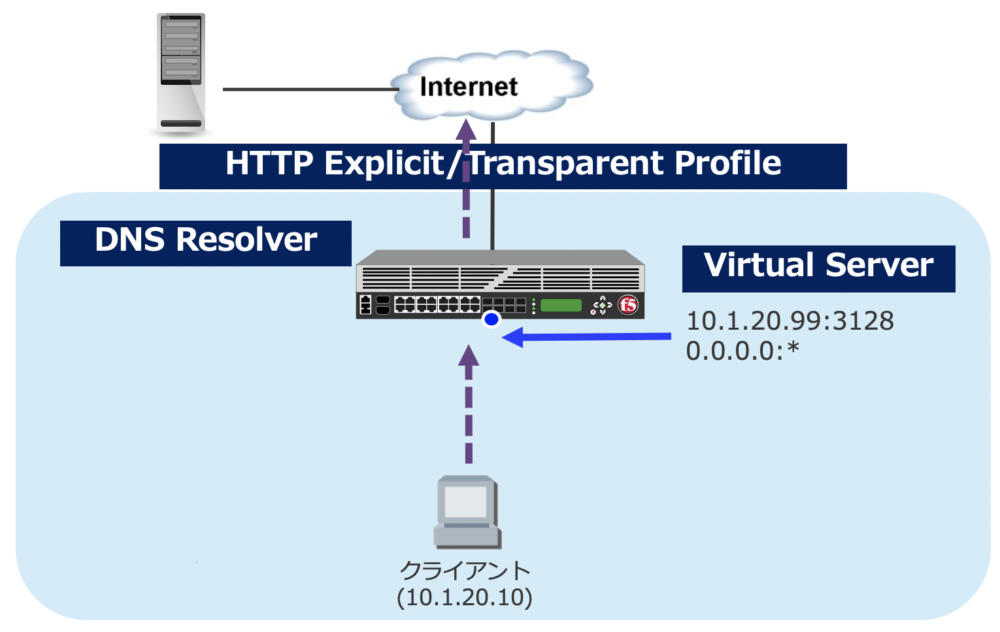

関連するオブジェクト
===========================

本節では、BIG-IPをForward Proxyで利用する上で必要となる、オブジェクトの概要について紹介します。
詳細は、下図をご参照ください。

   BIG-IPでForward Proxyを構成する際のオブジェクト

- **HTTP Explicit Profile**
  

  BIG-IPをクライアントから見た明示 (Explicit) プロキシとして設定する場合に利用するプロファイルです。

- **HTTP Transparent Profile**

  BIG-IPをクライアントから見た透過 (Transparent) プロキシとして設定する場合に利用するプロファイルです。

- **DNS Resolver**

  Forward Proxyとして動作するBIG-IPがクエリを行う、DNSサーバのアドレスを指定します。DNSサーバのレスポンスは、BIG-IP内にキャッシュされます。

- **Virtual Server**
  
   
  BIG-IPで、サービスを受け付けるリスナーとして動作します。Virtual Serverで指定したIPアドレスおよびポート番号を、クライアント端末のWebブラウザ等に設定します。
