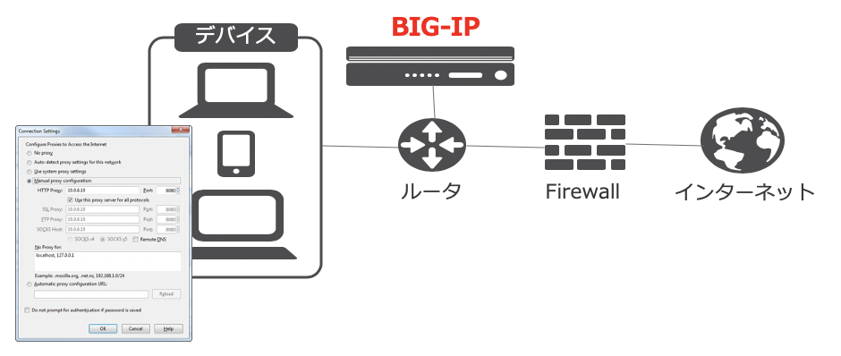

Explicit Forward Proxy トポロジー
===========================

BIG-IPを明示 (Explicit)プロキシとして使用するの場合のトポロジーは、下図の通りです。

- BIG-IPを明示 (Explicit)プロキシとして構成する場合は、クライアント端末のWebブラウザ等でリクエストをプロキシサーバ宛に送信するように設定します。PAC (Proxy Auto Config)ファイルやWPAD (Web Proxy Auto Discovery Protocol)を使用することで、ブラウザ側の設定を自動化することも可能です。
- 既存ネットワーク構成の変更は最小限で済むトポロジーです。
