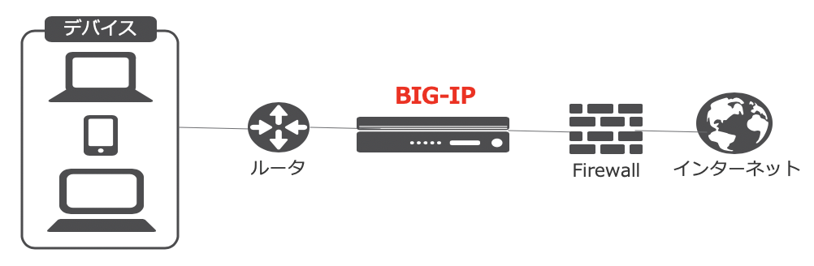

Transparent Forward Proxy トポロジー
===========================

BIG-IPを透過 (Transparent)プロキシとして使用するの場合のトポロジーは、下図の通りです。

- BIG-IPを透過 (Transparent)プロキシとして構成する場合は、BIG-IPをルータやFireWall等の間に"挟み込む"形で導入することで、クライアントからのリクエストが自動的にプロキシサーバに送信されます。この構成の場合、クライアントはプロキシの存在を意識しないため、Webブラウザ等の設定は不要です。
- リクエストがプロキシサーバに送られるようにするために、既存ネットワーク構成の変更が必要となる場合があります。
