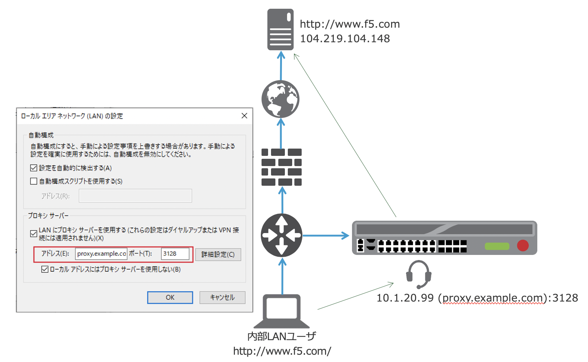
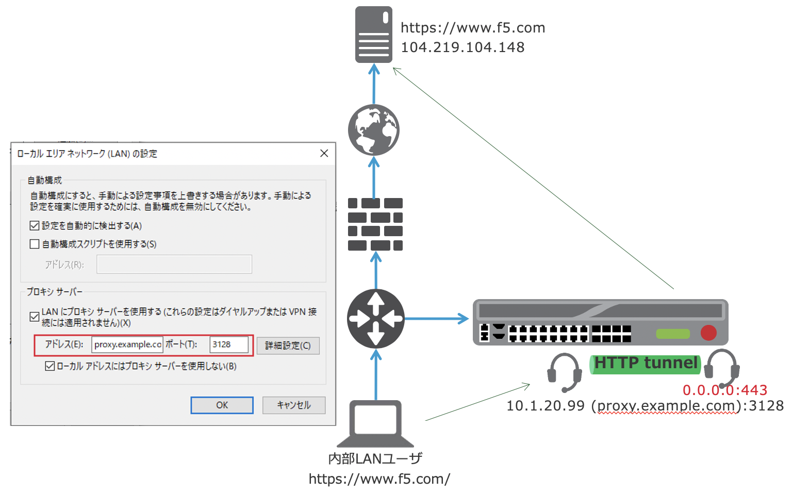

サンプル構成
===========================

本章で紹介する構成は、以下の通りです。

- クライアントソフトウェア (ブラウザ)では、リクエストを直接プロキシサーバ (=BIG-IP)に転送するように設定します。
- BIG-IPにおいて、プロキシサーバとして動作するVirtual Serverを設定します。また、BIG-IP (プロキシサーバ)はホストの名前解決にDNSリゾルバを使用します。 (例: www.f5.com → 104.219.104.148)

- HTTPS Forward Proxyの場合は、HTTPにおける設定に加えて、前述のHTTPトンネル用のVirtual Serverの設定が必要となります。