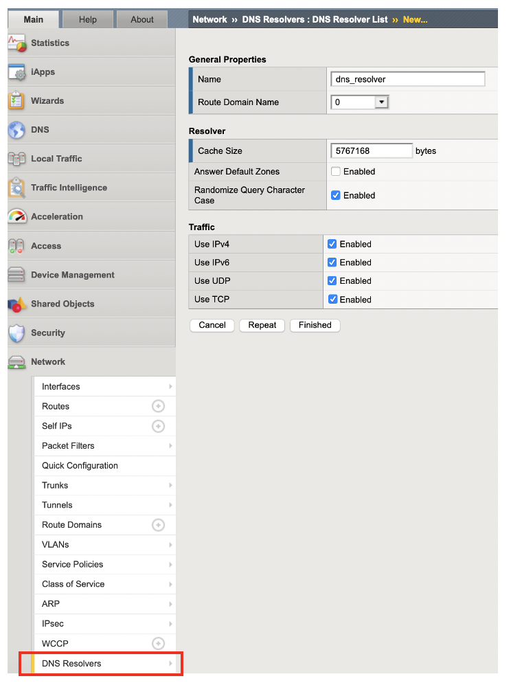
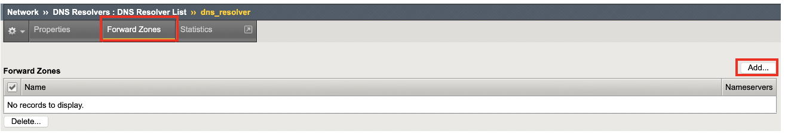

DNSリゾルバの設定
===========================

BIG-IPのConfiguration Utilityで、DNSリゾルバを設定します。

**Network >> DNS Resolver** を選択して、DNSリゾルバを作成します。下図の例では"dns_resolover"という名前のDNSリゾルバを作成しています。

作成したDNSリゾルバにおいて、**Forward Zone** を選択します。

Forward　Zoneの名前を". (ドット)"と指定して、BIG-IPがクライアントとして名前解決を行うDNSサーバのアドレスを入力します。

.. figure:: images/mod2-2-3.png
   :scale: 60%
   :align: center
