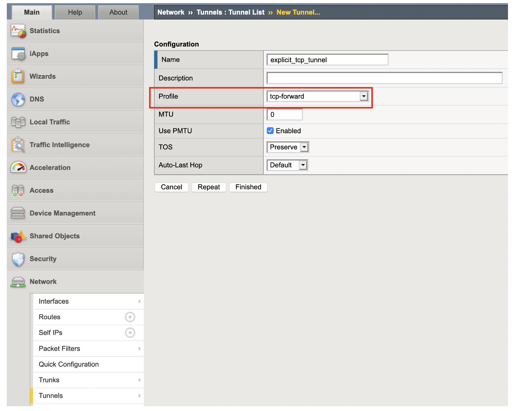

TLSをサポートするHTTP Tunnelの設定
===========================

TLS (SSL)をサポートするHTTP Tunnelを設定します。

**Network >> Tunnels** を選択して、HTTP Tunnelを作成します。ここではForward Proxyとして構成するため、Profileとして **tcp-forward** を指定します。

