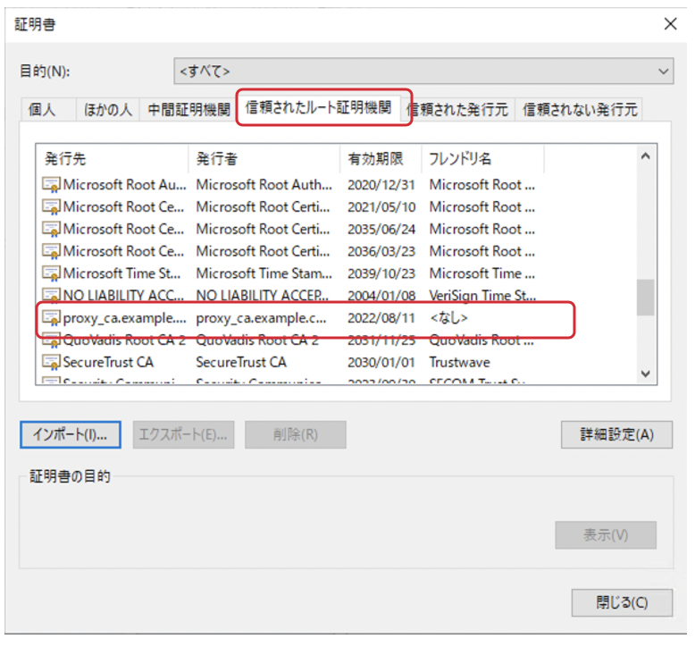

CA証明書の設定例
===========================

SSL Forward Proxyを構成する場合は、BIG-IPにCA証明書と秘密鍵をインストールします。ここでは、BIG−IP上でCLIで設定する手順を紹介します。

.. code-block:: bash

   # opensslに必要なファイルとディレクトリの作成
   mkdir /config/ca
   cd /config/ca
   mkdir /config/ca/newcerts
   mkdir /config/ca/private
   mkdir /config/ca/crl
   touch /config/ca/index.txt
   echo 01 > /config/ca/serial
 
   # openssl設定ファイルをコピー 
   cp /etc/pki/tls/openssl.cnf /config/ca
 
   # openssl.cnfファイルの設定
   vi /config/ca/openssl.cnf
   unique_subject  = no   
   dir             = /config/ca
 
   # BIG-IPがSSL可視化を行うために使用する、CA証明書とキーを生成
   # 注: Common Nameとして"proxy_ca.example.com"を指定
   openssl req -x509 -nodes -days 3650 -newkey rsa:2048 -out proxy_ca.pem -outform PEM -keyout proxy_ca.key
 
   # CA証明書を確認
   openssl x509 -in proxy_ca.pem -noout -text
 
   # BIG-IPのファイルストアにインポート
   tmsh install sys crypto cert proxy_ca.crt from-local-file /config/ca/proxy_ca.pem
   tmsh install sys crypto key proxy_ca.key from-local-file /config/ca/proxy_ca.key

ブラウザでのアクセス時にセキュリティ警告が表示されるのを防ぐため、上記で生成したCA証明書をクライアント端末にインポートします。例えばWindowsの場合、「信頼されたルート証明機関」にBIG-IPが再署名に使用する証明書を追加します。

